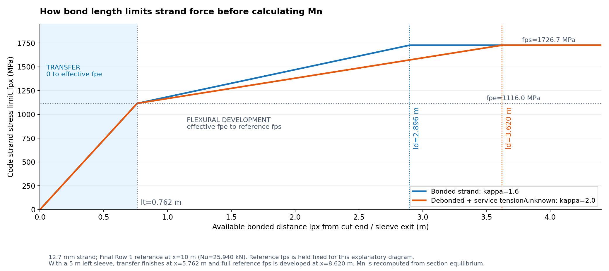
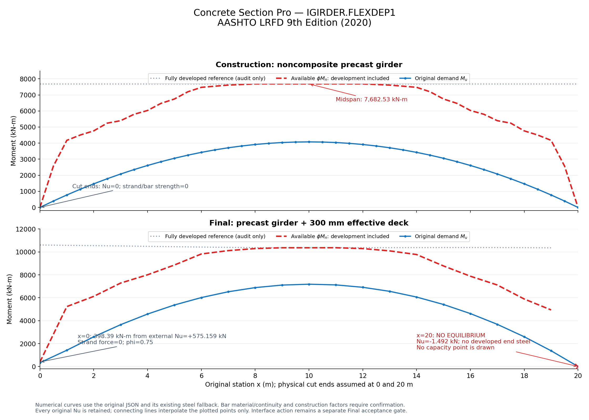

# Concrete Section Pro — การแก้ φMn และผลของ strand development

วันที่ 2026-10-04 · รุ่น **IGIRDER.FLEXDEP1** · มาตรฐานโครงการ **AASHTO LRFD 9th Edition (2020)**

แก้ทั้งหน้า Construction และ Final Composite ให้จำกัดแรงของ strand แต่ละกลุ่มตามระยะ bond แล้วหาสมดุลหน้าตัดใหม่ เก็บ Nu เดิมทุกสถานี ใช้ stress block และ φ ตาม AASHTO และเพิ่ม Calculation trace / Equations ที่อ่านผลจากการกด Calculate ครั้งนั้น

## Code ระบุอะไร

แหล่งหลักคือไฟล์ AASHTO Section 5 ที่แนบกับโครงการ ข้อ **5.9.4.3.1–3** หน้าเลขพิมพ์ **5-143–5-145** กำหนดให้พิจารณาการเพิ่มขึ้นของแรงลวดใน end zone สำหรับการหากำลังต้านทาน

| ระยะ | ความหมาย | กำลังที่พัฒนาได้ |
|---|---|---|
| Transfer length, lt | ระยะถ่ายแรงอัดประสิทธิผลจากลวดเข้าสู่คอนกรีต | จากศูนย์ถึง fpe |
| Development length, ld | ระยะ bond ทั้งหมดที่ต้องมีเพื่อพัฒนา stress ณ nominal resistance | ถึง fps ที่ใช้หา Mn |

ld **รวม lt อยู่แล้ว** ไม่ต้องบวก lt ซ้ำ ตัวลวดยังมีอยู่ทางกายภาพใน sleeve แต่ช่วงนั้นยังไม่มี bond ที่จะพัฒนากำลังลวดเข้าหน้าตัด

สำหรับ pretensioned strand ข้อ 5.9.4.3.1 อนุญาตให้ใช้

$$l_t=60d_b$$

ดังนั้น strand 12.7 mm มี lt=762 mm

ข้อ 5.9.4.3.2 กำหนด

$$l_d\geq\kappa\left(f_{ps}-\frac{2}{3}f_{pe}\right)d_b\qquad\text{เมื่อ stress ใช้ ksi และ db ใช้ in.}$$

รูปแบบ SI ที่ใช้ในแอปคือ

$$l_d[\mathrm{mm}]=\kappa\frac{f_{ps}[\mathrm{MPa}]-\frac{2}{3}f_{pe}[\mathrm{MPa}]}{6.894757293168}\,d_b[\mathrm{mm}]$$

fpe คือ Pe ประสิทธิผลของ stage นั้นหารด้วยพื้นที่ลวดต่อเส้น ส่วน fps คือ stress ณ nominal section resistance ที่พัฒนาได้ครบตาม material law ปัจจุบัน จึงไม่ได้กำหนดให้เท่ากับ fpu โดยอัตโนมัติ

κ=1.0 เมื่อ precast member ลึกไม่เกิน 24 in (609.6 mm) และ κ=1.6 เมื่อลึกมากกว่านั้น ข้อ **5.9.4.3.3F** กำหนด **κ=2.0 สำหรับ partially debonded strand เมื่อมี tensile stress ที่ service limit state ใน precompressed tensile zone** แอปใช้ κ=2.0 เมื่อยังไม่จำแนก service tension และมีช่องยืนยันกรณีไม่มี tension เพื่อใช้ depth branch ตาม code

ลวด pretensioned ที่ใส่ sleeve บางช่วงยังเป็นระบบ bonded pretensioned ในช่วงที่เหลือ การเลือก φ ของทั้งหน้าตัดต้องอ้างอิงประเภทและ net tensile strain ของหน้าตัดตามข้อ 5.5.4.2

## แรงลวดเพิ่มตามระยะอย่างไร

ให้ lpx เป็นระยะ bond ที่มีจริง วัดจากปลายตัดสำหรับลวด bonded หรือจาก **ปลาย sleeve** สำหรับลวด debonded และตรวจจากทั้งสองปลายโดยใช้ด้านที่มีระยะน้อยกว่า

$$f_{px}=\begin{cases}
0 & l_{px}=0\ \text{หรืออยู่ใน sleeve}\\
f_{pe}\,l_{px}/l_t & 0<l_{px}<l_t\\
f_{pe}+\dfrac{l_{px}-l_t}{l_d-l_t}(f_{ps}-f_{pe}) & l_t\leq l_{px}<l_d\\
f_{ps} & l_{px}\geq l_d
\end{cases}$$

ข้อ 5.9.4.3.2 อนุญาต idealized linear increase ดังสมการนี้ และข้อ 5.9.4.3.3 ให้นับระยะสำหรับ strand debonded จากปลาย debonded zone

ตัวอย่างจาก **Final Row 1 ที่ x=10 m ของ JSON เดิม**: Pe=110.149 kN/strand, Aps=98.7 mm² จึงได้ fpe=1115.998 MPa และ reference fps=1726.718 MPa

| กลุ่ม | κ | lt | ld |
|---|---:|---:|---:|
| Bonded, precast depth=1500 mm | 1.6 | 0.762 m | 2.896 m |
| Debonded, service tension/ยังไม่ยืนยัน | 2.0 | 0.762 m | 3.620 m |

ถ้า sleeve เริ่มจากปลายซ้ายและยาว 5 m ลวดกลุ่มนั้นเริ่มพัฒนาแรงเมื่อพ้น x=5 m ถึง fpe ที่ x=5.762 m และถึง reference fps ประมาณ x=8.620 m ทุกสถานีจริงยังใช้ Nu และ reference fps ของตนเอง ตัวเลขนี้ใช้สอนความหมายของระยะ

## มีผลต่อ Mn อย่างไร

แรงดึงของแต่ละกลุ่มคือ Tps=Aps×fps_used โดย fps_used ไม่เกิน stress limit fpx ของกลุ่มนั้น เมื่อ bond สั้นลง แรงลวดที่อนุญาตลดลง และตำแหน่ง neutral axis/แรงอัดคอนกรีต/แรงเหล็กธรรมดา/แขนโมเมนต์ต้องหาจากสมดุลใหม่

ในรูปแบบหน้าตัดง่ายที่ Nu=0 และไม่มีเหล็กธรรมดา จะได้ C=T และ Mn=T(dp−a/2) การลด T ทำให้ทั้งแรงและความลึก stress block เปลี่ยนไป แอปจึงจำกัดแรงทีละกลุ่มและคำนวณหน้าตัดใหม่

สำหรับ Nu ที่นำเข้า แอปหาค่า c ให้

$$\phi P_n(c)=N_u,\qquad M_r=\phi M_n$$

φ ตามข้อ **5.5.4.2** ของ bonded prestressed member ใช้ net tensile strain ที่ไม่รวม initial prestress: φ=0.75 ใน compression-controlled region, φ=1.00 เมื่อ εt≥0.005 และ interpolate ระหว่าง εt=0.002–0.005 โปรแกรมใช้ φ เดียวกันกับทั้ง Pn และ Mn

แรง Pe อยู่ใน initial strand strain ของ solver และลดตาม transfer length แล้ว การนำ Nu เข้าใช้ต้องตรงกับ reference/เครื่องหมายของโมเดล FEA และไม่บวก Pe ซ้ำเป็น external Nu

## ผลที่ปลายคานของไฟล์นี้

ผลด้านล่างใช้ JSON เดิม ซึ่งมี deck 300 mm กำหนด physical cut ends ที่ x=0 และ x=20 m เพราะยังไม่มีข้อมูลระยะส่วนยื่นถึง bearing และไม่ได้ให้เครดิต anchorage ของเหล็กธรรมดาที่ปลาย

| ผล | x=0 | x=10 | x=20 |
|---|---:|---:|---:|
| Construction Nu (kN) | 0 | 0 | 0 |
| Construction φMn (kN-m) | 0 | 7,682.53 | 0 |
| Final Nu (kN), อัดเป็นบวก | +575.159 | +25.940 | −1.492 |
| Final φMn (kN-m) | 398.39 | 10,363.29 | หาสมดุลไม่ได้ |

Construction มี Nu=0 และแรงลวด/เหล็กที่พัฒนาได้เป็นศูนย์ ณ ปลายตัด จึงได้กำลังศูนย์ตามสมดุลนั้น ส่วน Final ที่ x=0 มี external Nu อัด 575.159 kN จึงเกิดแรงอัดคอนกรีตและต้านทานโมเมนต์บางส่วนได้ โดย **แรง strand เป็นศูนย์** และ φ=0.75

Final ที่ x=20 มี Nu ดึง 1.492 kN เมื่อไม่มี developed end steel จึงไม่มีสมดุลภายในขอบเขตนี้ โปรแกรมแสดง **NO EQUILIBRIUM / FAIL** เก็บค่า Mn เป็น unavailable และเว้นเส้นกำลังในกราฟ

หาก x=0/20 ใน FEA เป็นแนว bearing และมีส่วนคานยื่นออกไป ต้องใส่ระยะจากปลายตัดถึงแนว bearing ตามแบบ ลวด bonded จะมี bond อยู่ก่อนถึงสถานีนั้น จึงอาจมีกำลังที่ bearing มากกว่าศูนย์ การกำหนดระยะนี้ต้องตรงกับตำแหน่งต้นแกน x ของข้อมูล Loads

## การใช้งานรุ่นแก้ไข

1. เปิดโครงการจาก ZIP ใหม่และโหลด JSON ของโครงการ
2. ใน Materials ให้กำหนดวัสดุที่ตรงกับชื่อเหล็กในตาราง Rebar ไฟล์ JSON เดิมใช้ชื่อ SD40 แต่ไม่มี material definition ดังนั้นผลตัวอย่างใช้ fallback เดิม fy=390 MPa, Es=200,000 MPa และคง REVIEW ไว้
3. ไป Analysis → ULS → Flexure เปิด **Flexure development / physical beam ends** ระบุระยะจริงและ service condition ของลวด debonded
4. ยืนยันความต่อเนื่อง/cutoff ของเหล็กธรรมดาจากแบบ และยืนยัน full end anchorage เฉพาะที่พิสูจน์ได้ หรือใส่ governing ld ที่ตรวจแล้ว ถ้ายังไม่ยืนยัน โปรแกรมแสดง numerical curve พร้อม REVIEW
5. กด Calculate แยก Construction และ Final Composite แล้วเปิด **Calculation trace / Equations** เลือกสถานีที่ต้องการตรวจ จะเห็น Nu, c, φ, Cc, แรงเหล็ก, residual และทุกกลุ่มลวดพร้อม lpx/lt/ld/fpx/fps_used

Ordinary straight bars ใช้ข้อ 5.10.8.2.1a–c โดยอัตโนมัติแบบ conservative: location/coating product=1.7, ไม่ลด confinement/excess สำหรับ full-yield reference length, และขั้นต่ำ 12 in (304.8 mm) การให้แรงบางส่วนยังคงขั้นต่ำดังกล่าว ลวด strand ใช้กฎสองช่วงของ 5.9.4.3 แยกจาก ordinary bars

ข้อมูลตั้งค่านี้บันทึกใน metadata ของ project JSON รุ่นเดิม ผล φMn ก่อน FLEXDEP1 จะ stale และต้อง Calculate ใหม่ Calculation trace อ่านผลที่เก็บแล้ว ไม่มีการรัน solver ซ้ำเมื่อเปิดตาราง

## การตรวจที่ทำแล้ว

ตรวจสมการด้วย independent rectangular-section hand calculation, ตัวอย่าง unit conversion ของ FHWA, ขอบเขต κ, sleeve exit ทั้งสองด้าน, φ transition, zero-force cut ends, Nu อัด/ดึง, actual deck-bar diameter, metadata roundtrip และ stale stage versions รวม 18 tests เฉพาะโมดูลใหม่นี้

ตรวจทุก 41 Construction stations และทุก 21 Final stations จาก JSON: Nu และ coupled demand rows คงเดิม, actual strand stress ไม่เกิน cap, full development กลับไปให้ reference capacity, residual สูงสุดต่ำกว่า 0.02 N และ geometry/source JSON ไม่เปลี่ยน

โครงการที่แตกจาก ZIP ใหม่ผ่าน **375 tests ใน 37 modules ที่เลือกตรวจ** รวม 18 tests ของโมดูลใหม่ compileall และการเปิด app.py ผ่านด้วย ตรวจปุ่ม Calculate และ trace ของทั้งสอง stage ไม่พบ browser/application error

Engine ใช้เวลาประมาณ 1.9 s ต่อ stage; ปุ่ม Calculate ในหน้า production ใช้เวลา Construction 3.372 s และ Final 2.977 s รวมแสดงผล รักษา Nu ไว้ได้เพราะใช้ fixed-axis equilibrium สำหรับ Mux โดยตรงและใช้ซ้ำเฉพาะ reference ที่มี Nu เท่ากัน

รายงานนี้เป็นการตรวจ section φMn และ development ภายในขอบเขตปัจจุบัน ส่วน Construction factors, bar material/layout, effective composite width, interface shear, debonding detailing, negative composite flexure และ concurrent biaxial demand มีสถานะตรวจของตนเอง ผล section D/C ผ่านยังต้องผ่าน acceptance gates ที่เกี่ยวข้อง

แหล่งประกอบสำหรับกลไก gradual strand stress/debonding: [FHWA Prestressed Concrete Girder Design Example — Flexural Resistance](https://www.fhwa.dot.gov/bridge/lrfd/pscus055.cfm) ตัวอย่างนี้ใช้เลขข้อของ AASHTO รุ่นเก่า การแก้โค้ดนี้อ้างอิงเลขข้อและสมการจากไฟล์ **9th Edition (2020)** ที่ผู้ใช้ให้เป็นหลัก
