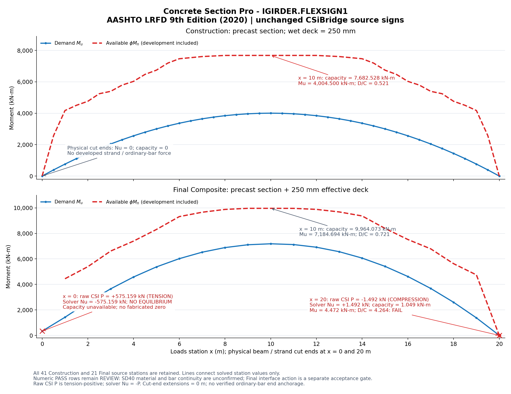

# Concrete Section Pro — ผลตรวจ IGIRDER.FLEXSIGN1

ข้อมูลที่คุณยืนยันว่าเก็บเครื่องหมายทั้งหมดตาม CSiBridge ทำให้ต้องแก้การอ่าน Nu ครับ CSiBridge frame P เป็น **บวกเมื่อดึง ลบเมื่ออัด** แต่ solver หน้าตัดของแอปใช้ **บวกเมื่ออัด ลบเมื่อดึง** จึงต้องแปลงภายในเป็น Nu=−P โดยคงค่าดิบใน Loads ไว้ การแปลงนี้ใช้ร่วมกันทั้ง Flexure, Shear, Torsion และ Shear + Torsion ส่วนเครื่องหมาย Mux, Muy, Vuy, Vux และ Tu ยังเดิมภายใต้ axis mapping ที่มีอยู่

คำอธิบายและผลเดิมที่ถือ x=0 เป็นแรงอัด และ x=20 เป็นแรงดึง ใช้ไม่ได้กับไฟล์ที่เก็บเครื่องหมาย CSI นี้แล้วครับ รุ่นใหม่แสดงทั้งค่าดิบและค่าที่ solver ใช้ เพื่อให้ตรวจย้อนกลับได้

## ผล Final Composite ที่แก้ convention แล้ว

ใช้ deck 250 mm ตาม PDF ล่าสุด ทั้ง x=0 และ x=20 เป็นปลายคาน/ปลายตัดลวดจริง ไม่มี extension และยังไม่มีการยืนยัน anchorage ของเหล็กธรรมดา

| x (m) | P ดิบจาก CSI (kN) | แรงจริง / Nu ใน solver | Mu (kN·m) | φMn (kN·m) | ผล |
|---|---:|---|---:|---:|---|
| 0 | +575.159 | ดึง / −575.159 | 334.564 | หา equilibrium ไม่ได้ | FAIL |
| 10 | +25.940 | ดึง / −25.940 | 7,184.694 | 9,964.073 | D/C=0.721; numerical PASS แต่ยัง REVIEW |
| 20 | −1.492 | อัด / +1.492 | 4.472 | 1.049 | D/C=4.264; FAIL |

ที่ x=0 ระยะ bond ที่ปลายตัดเท่ากับศูนย์ทุกกลุ่มลวด และไม่มีการให้กำลังเหล็กธรรมดาที่ปลายโดยไม่มีหลักฐาน anchorage จึงไม่มีแรงดึงของเหล็กมาสมดุลกับแรงดึง 575.159 kN ภายใต้โมเดล ULS ที่ไม่ใช้กำลังดึงของคอนกรีต ค่า φMn จึงไม่สามารถระบุได้ ต้องแสดงช่องว่างและ FAIL ที่สถานีนั้น

ที่ x=20 แรงจริงเป็นแรงอัด 1.492 kN คอนกรีตอัดจึงเกิด equilibrium ได้ ให้กำลังดัดเล็กน้อย φMn=1.049 kN·m แม้แรงลวดเท่ากับศูนย์ กราฟเส้นประแดงจึงไปถึง x=20 แล้ว แต่ยัง FAIL เพราะต่ำกว่า Mu=4.472 kN·m การตรวจแรงที่ปลายจริงต้องทบทวน force reference จาก FEA และรายละเอียดถ่ายแรง/anchorage ใน D-region ด้วย

## Construction และกราฟ

Construction ที่ x=0/20 มี Nu=Mu=0 และ φMn=0 ส่วน x=10 มี φMn=7,682.528 kN·m, Mu=4,004.500 kN·m, D/C=0.521 เมื่อใช้ wet deck 250 mm ทั้ง 41 สถานี Construction และ 21 สถานี Final ถูกเก็บครบ ไม่ตัด Nu หรือสถานีปลายออกเพื่อให้รันเร็ว

กราฟนี้ใช้ผลคำนวณจริงที่แต่ละสถานี เส้นที่เชื่อมจุดเป็นการแสดงกราฟเท่านั้น ที่ x=0 Final ไม่มีการเติมศูนย์หรือสร้างกำลังขึ้นแทนผลที่หา equilibrium ไม่ได้ ส่วนการที่กราฟใน PDF ถูกตัดใกล้ x≈13 m เป็นอีกปัญหาหนึ่งของการพิมพ์ รุ่นนี้แนบ PNG เต็มช่วงให้ตรวจสอบ แต่ยังไม่ได้แก้ print CSS

## วิธีใช้รุ่นใหม่

1. แตก ZIP รุ่น IGIRDER.FLEXSIGN1 แล้วรัน `streamlit run app.py`
2. ใช้ project ปัจจุบันได้ โดยเลือก **Final ULS Nu input convention → CSiBridge / CSI frame P — positive tension, negative compression** ใน Loads หรือ Analysis และคงแรงที่นำเข้าทั้งหมดไว้
3. กด Calculate ใหม่ ผลเดิมจะถูกทำให้ stale เมื่อเปลี่ยน convention และ trace จะแสดงค่าดิบ/ค่าที่ solver ใช้
4. หากใช้ JSON ที่แนบใหม่ ไฟล์ตั้ง CSI convention และปลายตัด 0/20 m ไว้แล้ว พร้อมเปลี่ยน deck จาก 300 เป็น 250 mm ตาม PDF ล่าสุด ตาราง Loads ทุกค่าตรงกับ JSON เดิม

JSON ใหม่ยังไม่สร้าง SD40 หรือยืนยัน continuity/cutoffs/anchorage ให้แทนผู้ใช้ จึงยังมี REVIEW จากข้อมูลวัสดุ/รายละเอียด รวมถึง acceptance gate ของ composite interface, effective width และ Construction factors การที่ D/C ของหน้าตัดต่ำกว่า 1 ยังไม่ใช่การยืนยันทุก gate ผ่านครับ

หลักการยังเป็น AASHTO LRFD 9th Edition (2020): transfer length 60db=762 mm สำหรับ strand 12.7 mm วัดจากจุดเริ่ม bond ของแต่ละกลุ่ม ตาม 5.9.4.3.1–3; φ และ equilibrium ใช้ฐานเดียวกับ FLEXDEP1 การแก้ครั้งนี้แก้ source convention และคำอธิบายผล ไม่เปลี่ยนไปใช้ ACI

ผลเวลา engine ในเครื่องตรวจสอบ: Construction ประมาณ 1.83 s และ Final ประมาณ 1.93 s โดย Nu ยังถูกนำมาคิดครบ ทดสอบจาก ZIP ที่แตกใหม่ผ่าน 423 tests ใน 41 modules ที่เกี่ยวข้อง พร้อม compileall และการเปิดแอปเต็ม การกด Calculate ในหน้าแอปใช้ประมาณ 2.43 s / 2.90 s รวมการแสดงผล ไม่มี page/console/Streamlit error และทดสอบการเปลี่ยน convention แล้วคำนวณใหม่ผ่าน ผลตรวจอยู่ใน `qa/evidence/igird_flexsign1/` และ handoff รุ่นใหม่
